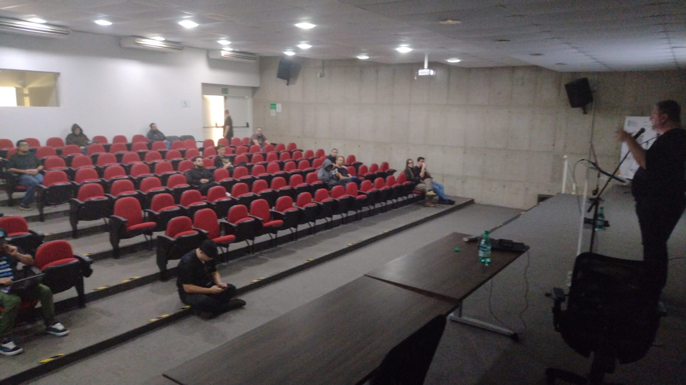

# global-azure-2026-04-piracicaba
Photos and information about the local edition of Global Azure in Piracicaba-SP, an event that took place on April 18, 2026 (Saturday).

## Event Information

Organizers:
- **Alexandre Ballestero de Paula (DEVPIRA)**
- **Renato Groffe (Microsoft MVP, Docker Captain, Grafana Champion, APISec U Ambassador, MTAC)**
- **Fábio Baldin (DEVPIRA)**

Number of attendees: **23 people**

---

Talks/panels that took place during the event:

_# Implementing Dynamic Configurations in Azure with Key Vault and App Configuration_

Speaker: **Murilo Beltrame (DEVPIRA)**

Technologies and topics covered: **Azure Key Vault, Azure App Configuration, .NET, C#, ASP.NET Core, Visual Studio Code...**

This talk is available on **YouTube**: https://www.youtube.com/watch?v=PrTmvGBwdgY

_# Containerized Applications on Azure: AKS or Container Apps, which is the best solution?_

Speaker: **Renato Groffe (Microsoft MVP, Docker Captain, Grafana Champion, APISec U Ambassador, MTAC)**

Technologies and topics covered: **Kubernetes, Microsoft Azure, Azure Kubernetes Service, Azure Container Apps, Azure Container Registry, Docker, Docker Hub, Grafana, Azure Managed Grafana, Prometheus, Azure Monitor, Application Insights, Azure Log Analytics, .NET 10, C#, ASP.NET Core, Linux, Cloud Native, CNCF, DevOps...**

_# Decoupling the Legacy: How to modernize your architecture with Azure SQL Change Event Streaming_

Speaker: **Milton Camara Gomes (Microsoft MVP)**

Technologies and topics covered: **Azure SQL, Event Streaming, SQL Server, .NET, C#, Microsoft Azure...**

_# Microsoft Fabric End-to-End - Real Case with INMET data_

Speaker: **Hugo Venturini (Microsoft MVP)**

Technologies and topics covered: **Microsoft Fabric, Data Analytics, Artificial Intelligence, Business Intelligence...**

---

Access this [**link**](/img/) to view all photos from the presentations.

Registration form: [**Eventiza**](https://eventiza.com.br/evento/devpira-global-azure-wknd-2026)

Venue: **Parque Tecnológico Piracicaba "Engenheiro Agrônomo Emílio Bruno Germek" - Rua Cezira Giovanoni Moretti, 600 - Jardim Santa Rosa - Piracicaba-SP - ZIP: 13414-157**

We extend our gratitude to [**Parque Tecnológico Piracicaba**](https://www.linkedin.com/company/parquetecnologicopiracicaba/) for the opportunity and all the support in promoting this local edition of Global Azure in Piracicaba-SP.

---

