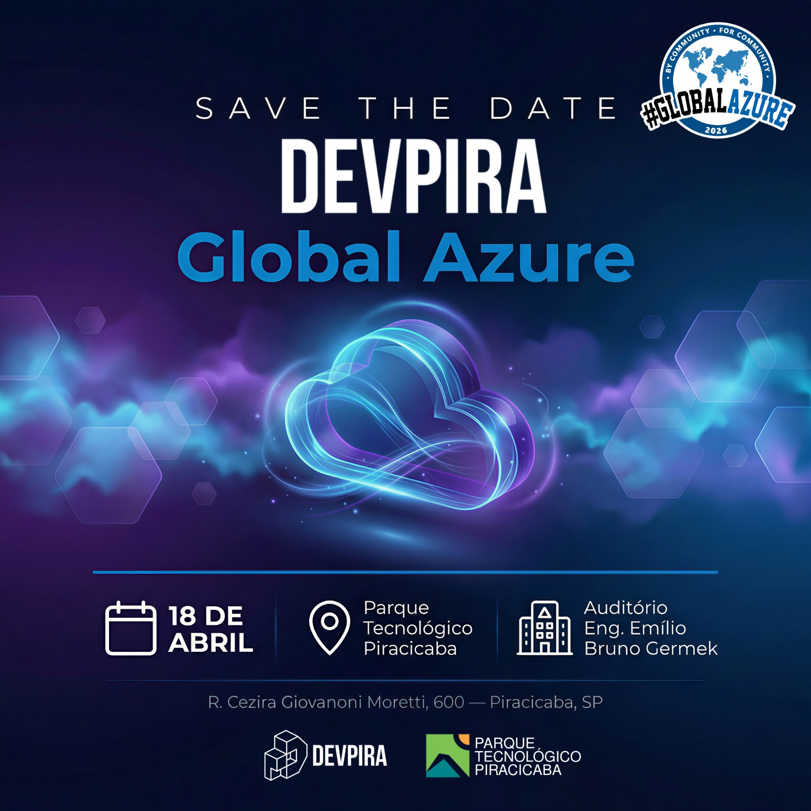
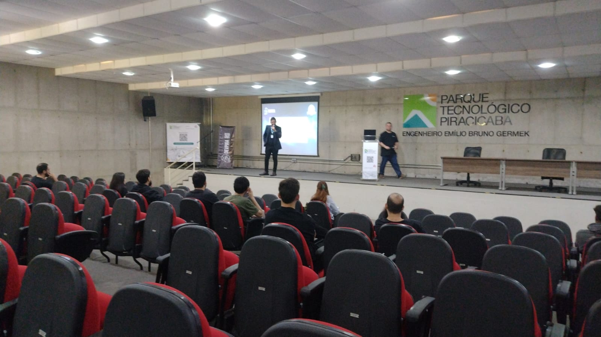
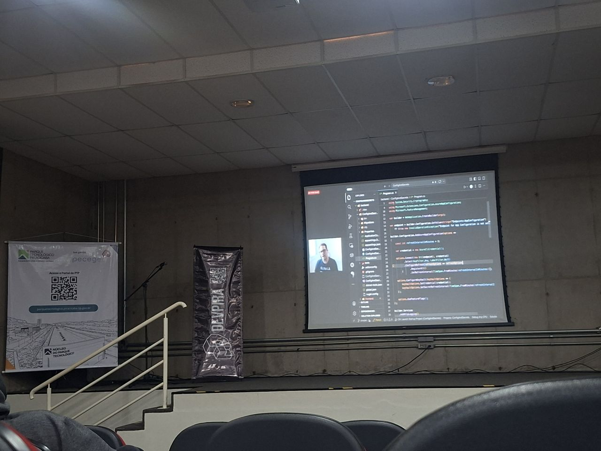
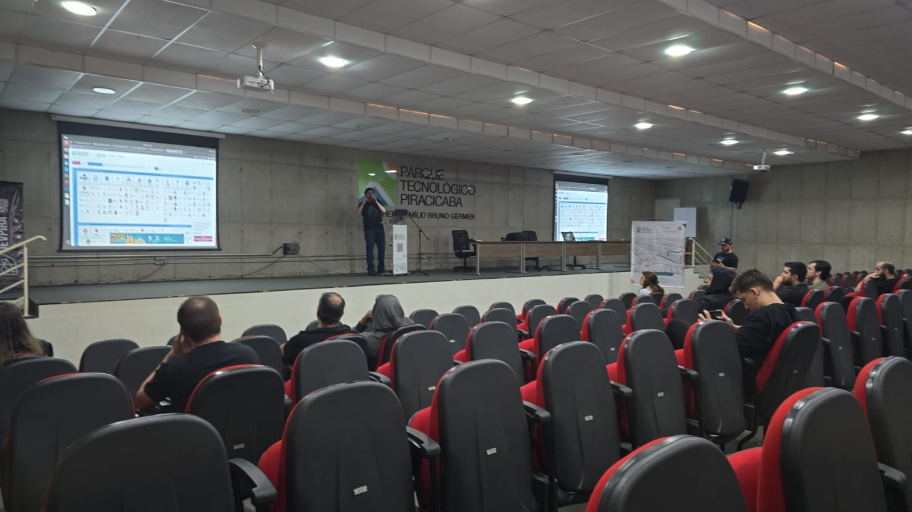
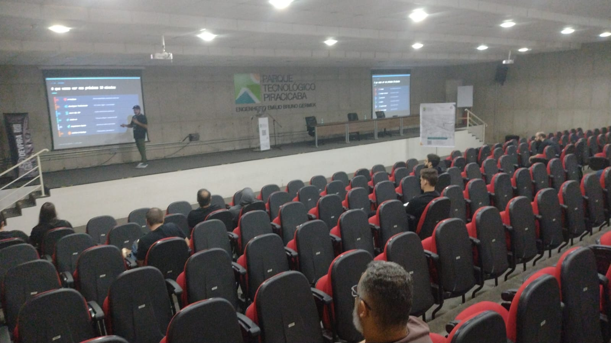
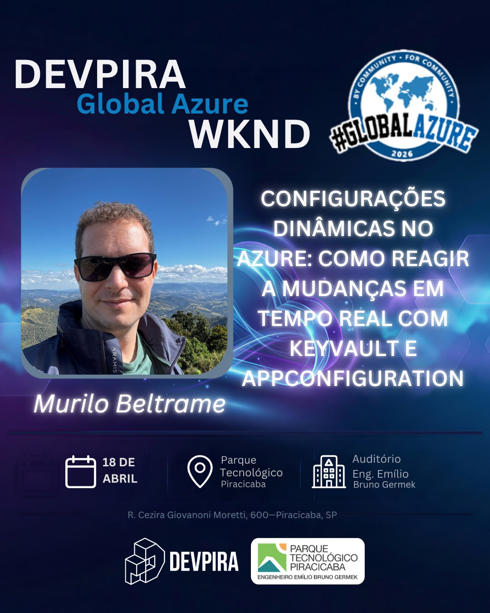
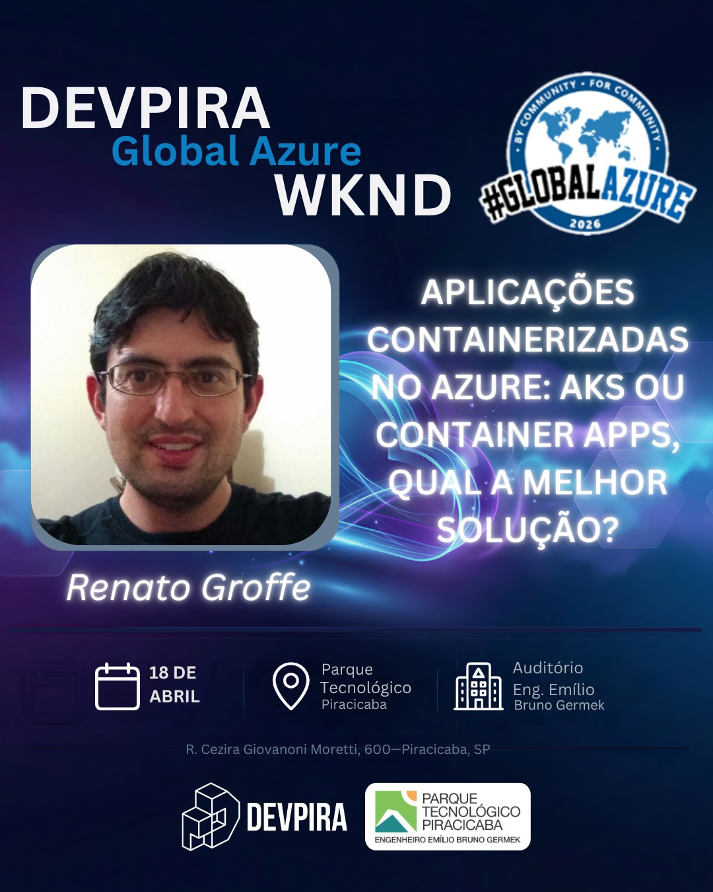
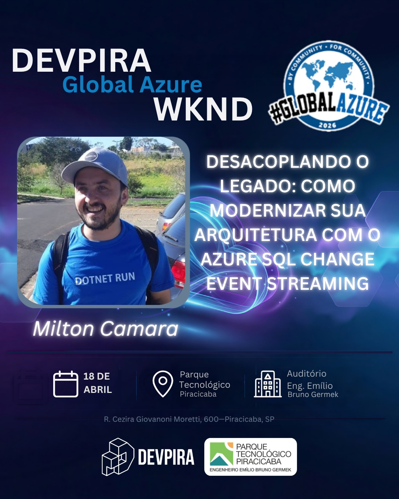
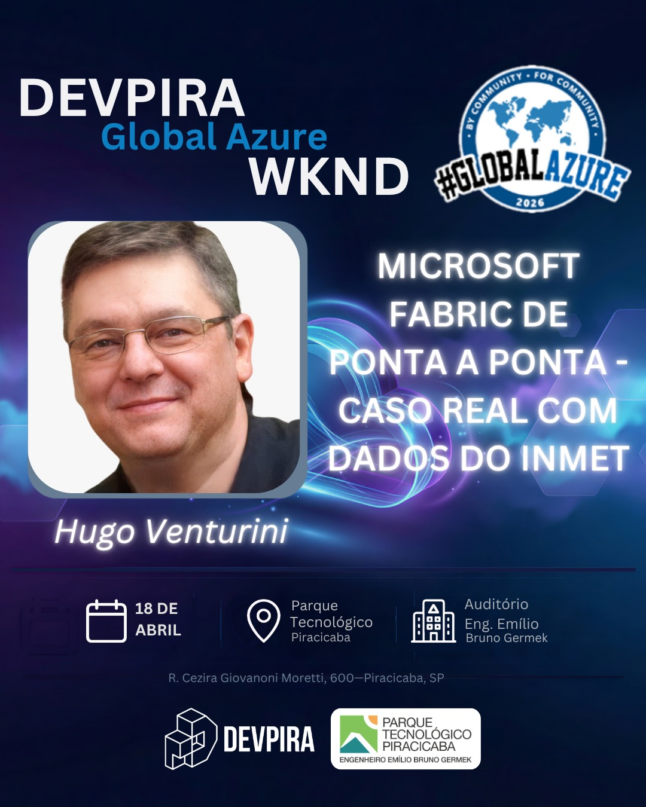
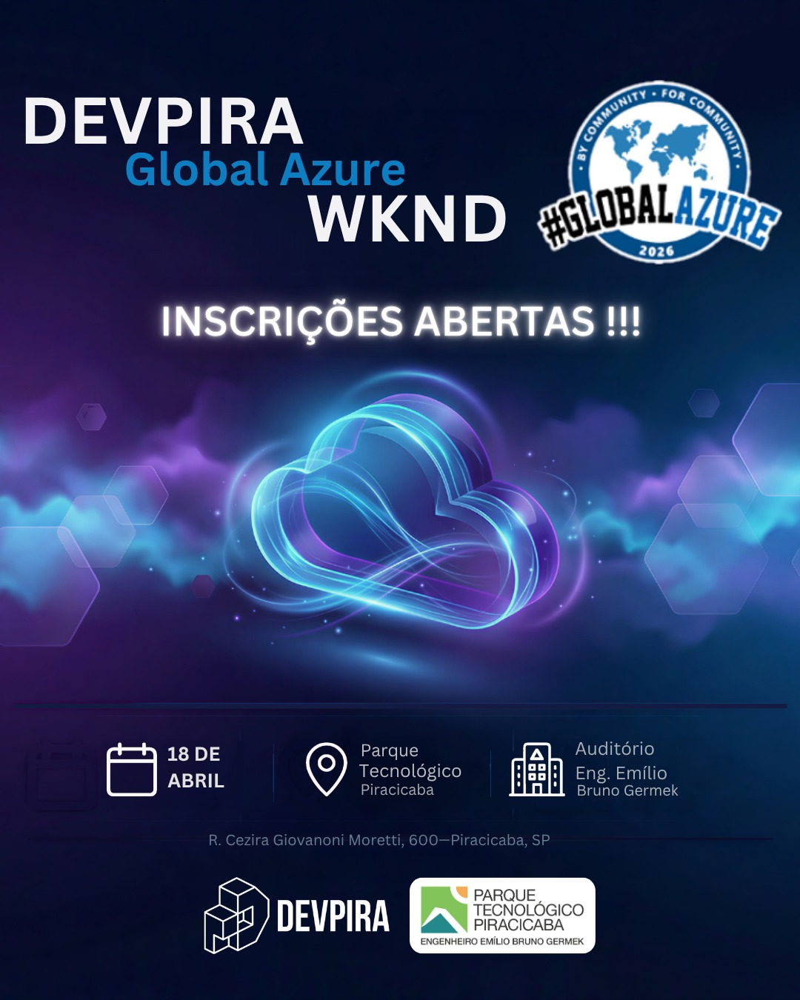

# global-azure-2026-04-piracicaba
Fotos e informações da edição local do Global Azure em Piracicaba-SP, um evento que aconteceu no dia 18/04/2026 (sábado).

## Informações sobre o evento

Organizadores:
- **Alexandre Ballestero de Paula (DEVPIRA)**
- **Renato Groffe (Microsoft MVP, Docker Captain, Grafana Champion, APISec U Ambassador, MTAC)**
- **Fábio Baldin (DEVPIRA)**

Número de participantes: **23 pessoas**

---

Apresentações/painéis que aconteceram durante o evento:

_# Implementando Configurações Dinâmicas no Azure com Key Vault e App Configuration_

Palestrante: **Murilo Beltrame (DEVPIRA)**

Tecnologias e tópicos abordados: **Azure Key Vault, Azure App Configuration, .NET, C#, ASP.NET Core, Visual Studio Code...**

Essa apresentação está disponível no **YouTube**: https://www.youtube.com/watch?v=PrTmvGBwdgY

_# Aplicações containerizadas no Azure: AKS ou Container Apps, qual a melhor solução?_

Palestrante: **Renato Groffe (Microsoft MVP, Docker Captain, Grafana Champion, APISec U Ambassador, MTAC)**

Tecnologias e tópicos abordados: **Kubernetes, Microsoft Azure, Azure Kubernetes Service, Azure Container Apps, Azure Container Registry, Docker, Docker Hub, Grafana, Azure Managed Grafana, Prometheus, Azure Monitor, Application Insights, Azure Log Analytcs, .NET 10, C#, ASP.NET Core, Linux, Cloud Native, CNCF, DevOps...**

_# Desacoplando o Legado: Como modernizar sua arquitetura com o Azure SQL Change Event Streaming_

Palestrante: **Milton Camara Gomes (Microsoft MVP)**

Tecnologias e tópicos abordados: **Azure SQL, Event Streaming, SQL Server, .NET, C#, Microsoft Azure...**

_# Microsoft Fabric de Ponta a Ponta - Caso Real com dados do INMET_

Palestrante: **Hugo Venturini (Microsoft MVP)**

Tecnologias e tópicos abordados: **Microsoft Fabric, Data Analytics, Inteligência Artificial, Business Intelligence...**

---

Acesse este [**link**](/img/) para visualizar todas as fotos das apresentações.

Formulário utilizado para inscrições: [**Eventiza**](https://eventiza.com.br/evento/devpira-global-azure-wknd-2026)

---

